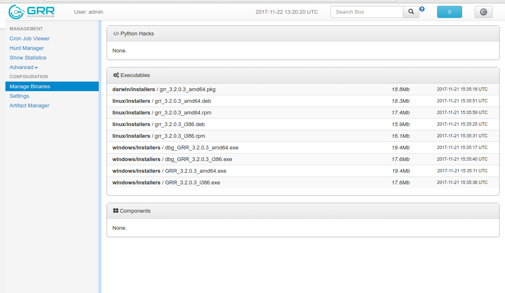

# Overview

This document describes getting clients up and running for
the first time.

## Getting started

Once we’ve got the GRR server installed and running we’ll
want to start deploying some clients.

To do so we’ll need to:

1.  Download the specific client version we need to install on the
    system.

2.  Decide on a deployment method.

3.  Perform the deployment and verify the results.

## Requirements

  - A number of machines (or VMs) to talk to the server. OSX, Windows and Linux
    clients are supported. Client and server can run on the same host for
    testing purposes.

## Installing the Clients

### Downloading clients

If your server install went successfully, the clients should have been uploaded
to the server with working configurations, and should be available in
the Admin UI.

Look on the left for "Manage Binaries", the files should be in the
executables directory, under installers.

If your server configuration has changed your clients will need to be
repacked with an updated config. For details see the server documentation.

Installation steps differ significantly depending on the operating system so we split
it into separate sections below.

Run the client on the target machine as administrator: [Windows instructions](on-windows.md),  [OSX instructions](on-mac-os-x.md), [Linux instructions](on-linux.md).

See [How to check if a deployed client talks back to the GRR server](how-to-check-if-client-talks-back.md).

## Uninstalling GRR

A quick manual on how to remove the GRR client completely from a machine is included in the platform-specific docs: [Windows instructions](on-windows.md#uninstalling-grr), [OSX instructions](on-mac-os-x.md#uninstalling-grr), [Linux instructions](on-linux.md#uninstalling-grr)

## Notes

### Deploying at scale

There shouldn’t be any special considerations for deploying GRR clients
at scale. If the server can’t handle the load, the clients should
happily back off and wait their turn. However, we recommend a staged
rollout if possible.

### Client and Server Version Compatibility and Numbering

We try hard to avoid breaking backwards compatibility for clients since
upgrading can be painful, but occasionally we need to make changes that
require a new client version to work. As a general rule you want to
upgrade the server first, then upgrade the clients fairly soon after.

Matching major/minor versions of client and server should work well
together. i.e. Clients 3.1.0.0 and 3.1.6.2 should work well with servers
3.1.0.0 and 3.1.9.7 because they are all 3.1 series. We introduced this
approach for the 3.1.0.0 release.

For older servers and clients, matching the last digit provided similar
guarantees. i.e. client 3.0.0.7 was released with server 0.3.0-7 and
should work well together.
